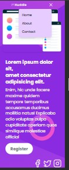
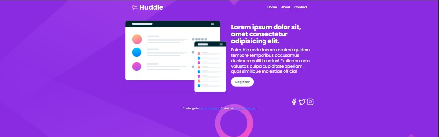

<h1>⚛️ HUDDLE-WITH-REACTJS</h1>

<p>
  A ReactJS rebuild of the classic Frontend Mentor Huddle landing page challenge, structured with reusable components and styled with modern CSS. This version highlights modular design, props usage, and state-driven UI improvements for a more scalable and interactive experience.  
</p>

<p>
  Huddle Landing Page (React + Tailwind)  
  This is my improved version of the Huddle landing page, built with React and styled with Tailwind CSS.  
  👉 The first version (built with plain HTML & CSS) can be found here: 
  <a href="https://github.com/EmmanuelKeziah/HUDDLE-HTML-CSS">Huddle with HTML/CSS</a>.
</p>

<hr/>

<h2>📌 Project Summary</h2>
<p>
  The goal of this project is to transform a static HTML/CSS Huddle landing page into a 
  <b>dynamic React application</b>.  
  It demonstrates how React can make development more modular and scalable 
  by breaking the UI into reusable components.
</p>

<hr/>

<h2>📌 Features</h2>
<ul>
  <li>Responsive design for all screen sizes</li>
  <li>Clean and reusable React components</li>
  <li>Organized project structure</li>
  <li>Styled with modern CSS practices</li>
</ul>

<hr/>

<h2>🧭 Live Demo</h2>
<p>
  🔗 <a href="https://huddle-with-reactjs.vercel.app/" target="_blank">View Live Site</a>
</p>

<hr/>

<h2>📷 Mobile Preview</h2>
<p>
  
</p>

<h2>📷 Desktop Preview</h2>
<p>
  
</p>

<hr/>

<h2>🛠️ Built With</h2>
<ul>
  <li>React.js: For building the UI components and managing state (like your useState toggle).
  </li>
    <li>Tailwind CSS: For styling and responsive design utilities.
  </li>
    <li>Vite: React project bundler and development server.
  </li>
  <li>Git & GitHub: For version control and remote repository hosting.
  </li>
  <li>Vercel (or Netlify): or deployment and hosting.
  </li>
</ul>

<h2>🎨 Assets & Tools
</h2>
<ul>
<li>React Icons (lucide-react / react-icons): For the hamburger menu and close icons.
</li>
<li>Google Fonts (like Poppins or Open Sans): For typography.
</li>
</ul>

<h2>👩‍💻 Dev Tools
</h2>
<ul>
<li>Browser DevTools / Responsive Viewer Extension: For checking responsiveness and debugging layouts.
</li>
<li>VS Code: IDE for writing and managing the code.
</li>
</ul>

<hr/>

<h2> Getting Started</h2>

<h3>Prerequisites</h3>
<ul>
  <li>Node.js installed on your system</li>
  <li>A package manager like npm or yarn</li>
</ul>

<h3>Installation</h3>
<p>Clone the repository and run it locally:</p>

```bash
git clone https://github.com/EmmanuelKeziah/HUDDLE-WITH-REACTJS.git
cd HUDDLE-WITH-REACTJS
npm install
npm run dev
```

<hr/>

<section>
  <h2>📁 Project Structure</h2>
  <pre>
huddle-with-reactjs/
├── public/
├── src/
│   ├── components/
│   ├── assets/
│   ├── App.jsx
│   └── main.jsx
├── package.json
└── README.md
  </pre>
</section>

<hr/>

<section>
  <h2>🧩 Component Breakdown</h2>
  <ul>
    <li><b>Navbar</b> – top navigation links</li>
    <li><b>Hero</b> – main banner section with CTA</li>
    <li><b>Footer</b> – social links and additional info</li>
  </ul>
</section>

<hr/>

<section>
  <h2>✅ Deployment</h2>
  <p>This project is deployed with <b>Vercel</b>. To deploy your own version:</p>
  <ol>
    <li>Push the project to GitHub</li>
    <li>Import the repo into <a href="https://vercel.com/" target="_blank">Vercel</a></li>
    <li>Deploy and get your live link</li>
  </ol>
</section>

<hr/>

<section>
  <h2>🧭 Roadmap</h2>
  <ul>
    <li>Add animations and transitions</li>
    <li>Improve accessibility (ARIA labels, semantic tags)</li>
    <li>Add testing with Jest or React Testing Library</li>
  </ul>
</section>

<hr/>

<section>
  <h2>📬 Contact</h2>
  <ul>
    <li>GitHub: <a href="https://github.com/EmmanuelKeziah" target="_blank">EmmanuelKeziah</a></li>
    <li>Email: <a href="mailto:keziahema@gmail.com">keziahema@gmail.com</a></li>
  </ul>
</section>

<hr/>

<section>
  <h2>📄 License</h2>
  <p>
    MIT License – free to use, modify, and distribute this project.  
    See the <a href="./LICENSE">LICENSE</a> file for full details.
  </p>
</section>
